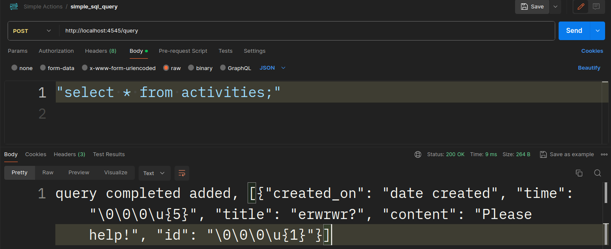

# HTTP to SQL

## About

(!) Not use it production environment it's very
dangereous!!!

it's simple service for use this service for make http query
with postman to DB

## How to use

- run container

```bash
docker run -it --name httpsql \
        -p 4545:4545\
        --detach \
        t1mon1106/http_to_sql
```

- make http query from postman


